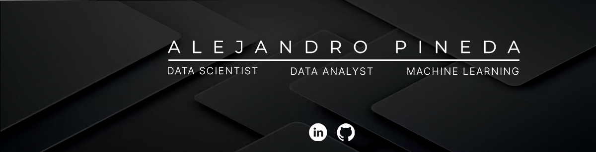

# 😎 I'm currenlty discover DataScience world.

## About me:

Passionate about technology and enjoying a career transition into Data Science.
* 📚 I'm currently learning and applying python and SQL languages into machine learning problems.
* 🤖 I love how machine learning is helping to add value to enterprises solutions.
* 📫 Do you want to contact me? 

## Skills:
🐍 Python

🧠 Scikit Learn, TensorFlow, Keras

🐼 Pandas

🧮 Numpy

